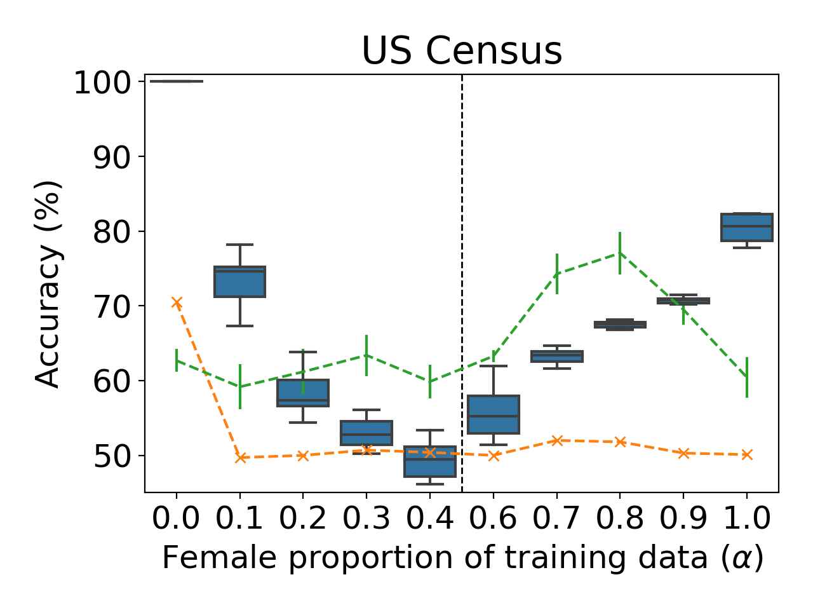
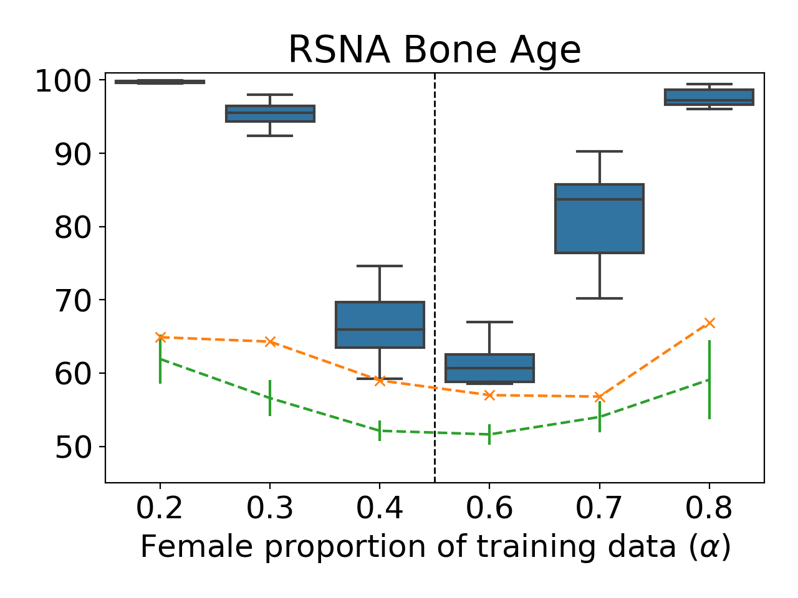

Inference attacks seek to infer sensitive information about the training process of a revealed machine-learned model, most often about the training data. Standard inference attacks aim to learn something about a particular record that may have been in that training data. For example, in a membership inference attack (Reza Shokri et al., [Membership Inference Attacks Against Machine Learning Models](https://ieeexplore.ieee.org/stamp/stamp.jsp?arnumber=7958568)), the adversary aims to infer whether or not a particular record was included in the training data. Differential Privacy (Cynthia Dwork, [Differential privacy: A survey of results](https://dl.acm.org/doi/abs/10.5555/1791834.1791836)) provides a theoretical notion of privacy that maps well to membership inference attacks. However, it provides privacy at the dataset level. Thus it cannot capture attacks that violate privacy at the distribution level. This is where property inference comes in. Property inference, a different kind of inference risk, involves an adversary that aims to infer some statistical property of the training dataset.

We illustrate the kind of risks introduced by Property Inference via an example:

WEP Inc., a (imaginary) hospital, trains and releases a machine learning regression model $M$ to predict the expenditure for a patient’s visit based on their attributes. However, the company ($\mathcal{A}$) that sells blood-pressure medication to this hospital sees an opportunity in this model: they seek to infer whether the probability of a patient in the hospital has high blood pressure is below 0.5 ($\mathcal{D}_0$) or not ($\mathcal{D}_1$). Suppose they can infer this highly sensitive information. In that case, they could decide to increase the cost of their medication, knowing that the hospital is in demand and would not protest much. Inferring this information would undoubtedly be a privacy leak: high blood pressure can be a symptom of various ailments that can have a wide range of estimated treatment costs, thus unrelated to the task.



## Formalizing Property Inference

Having seen via an example how property inference can be harmful, we move towards formalizing such distributional inference attacks. We first describe the cryptographic game for membership inference proposed by Yeom et al. ([Privacy Risk in Machine Learning: Analyzing the Connection to Overfitting](https://ieeexplore.ieee.org/stamp/stamp.jsp?arnumber=8429311)):



In this game, the victim samples a dataset $S$ from the distribution $\mathcal{D}$ and trains a model $M$ on it. It then samples some data-point $z$ from either $S$ or $\mathcal{D}$, based on $b \xleftarrow{R}\{0,1\}$. The adversary then tries to infer $b$ using algorithm $H$, given access to $(z, \mathcal{D}, M)$. This cryptographic game captures the intuitive notion of membership inference. It focuses on a particular dataset and sample: inferring whether a given data point was part of training data.
On the other hand, property inference focuses on properties of the underlying distribution ($\mathcal{D}$), not the dataset ($S$) itself. To capture property inference, we propose a similar cryptographic game. Instead of differentiating between the sources of a specific data point ($S$ or $\mathcal{D}$), we propose distinguishing between distributions ($\mathcal{D}_0$, $\mathcal{D}_1$).



A model trainer $\mathcal{B}$ samples a dataset $D$ from either of the distributions $\mathcal{D}_0$, $\mathcal{D}_1$. These distributions can be obtained from the publicly know distribution D by applying functions $\mathcal{G}_0$, $\mathcal{G}_1$ respectively, that transform distributions (and represent the "property" an adversary might care about). Given a model trained on this dataset $D$, can an adversary infer which of $\mathcal{D}_0$, $\mathcal{D}_1$ the model trainer used to sample its dataset? Frameworks like Differential Privacy do not apply here: the adversary here cares about statistical properties of the distribution $\mathcal{D}$, not details about a particular sample.

## Datasets and Attack Description

Most often in the literature, the adversary considers the ratio of members  in a dataset satisfying a particular Boolean function $f$ as the "property." It then aims to distinguish between models trained on datasets with different proportions. However, these experiments often test with arbitrary ratios, making it hard to understand the relative risk of different properties (Melissa Chase et al. [Property Inference From Poisoning](https://arxiv.org/abs/2101.11073), Wanrong Zhang et al. [Leakage of Dataset Properties in Multi-Party Machine Learning](https://arxiv.org/pdf/2006.07267.pdf)). To better understand how well an intuitive notion of divergence in properties aligns with observed inference risk, we execute property inference attacks with increasing diverging properties. We fix one property (ratio=0.5) and vary the other ($\alpha$).  We perform these experiments for three datasets: focusing on the ratio of females for the [US Census](https://dl.acm.org/doi/pdf/10.1145/380995.381030) and [RSNA BoneAge](https://pubs.rsna.org/doi/pdf/10.1148/radiol.2018180736) datasets, and the average node-degree for the [OGBN arXiv](https://direct.mit.edu/qss/article/1/1/396/15572/Microsoft-Academic-Graph-When-experts-are-not) dataset.

The go-to method for property inference attacks involves meta-classifiers, usually using Permutation Invariant Networks (Karan Ganju et al., [Property Inference Attacks on Fully Connected Neural Networks using Permutation Invariant Representations](https://dl.acm.org/doi/pdf/10.1145/3243734.3243834)). After training hundreds and thousands of models locally, the adversary trains a meta-classifier on model parameters. The process of model-parameter extraction involves constructing permutation-invariant representations of neurons per layer $h_i$ using learnable parameters $\phi_i$. These representations are then joined together for all layers with another learnable transform $\rho$, yielding the meta-classifier’s predictions. Here is a brief overview of the functioning of a Permutation Invariant Network:

<video loop type="video/mp4" autoplay="yes" allowfullscreen="no" src="PIM-Animation.mp4"> </video>

In addition to this attack, we propose two simple attacks that can be used as baselines:

- **Loss Test** to predict the property based on its performance on data from the same distribution it was trained, compared to the other distribution being analyzed.
- **Threshold** Test extends the loss test by calibrating performance trends on a small set of models and arriving at a threshold based on model performance.

## Experimental Results

Our results demonstrate how a meta-classifier can differentiate between models with ratios as similar as 0.4 v/s 0.5 (Figure 1). Further, the loss-test and threshold-test can serve as valuable baselines- providing accuracies significantly better than random-guessing.

<table>
<tr>
    <td style="width: 50%"> </td>
    <td style="width: 50%">  </td>
</tr>
</table>

Figure 1: Differentiating between models trained on datasets trained with 50% females v/s  females. Orange crosses are for the Loss Test; green with error bars are the Threshold Test; the blue box-plots are the meta-classifiers.

Our proposed definitions allow the property to hold over the whole dataset, not just aggregate statistics like mean ratio. Thus, we focus on node-classification for a graph: differentiating between versions of the graph with varying mean node-degrees as the property. We fix one property (mean node-degree 13) and vary the other ($\alpha$). Inferring the mean node-degree is a novel property inference task since the property here holds over the entirety of training data- no such property has been explored in the literature yet.

<table>
<tr>
    <td> </td>
    <td>  </td>
</tr>
<tr>
    <td> <xi>Figure 2: Differentiating between models trained on datasets trained with mean node-degree 13 v/s  on the OGBN arXiv dataset.</i> </td>
    <td> <i>Figure 3: Predicting the mean node-degree of training data graphs directly with a meta-classifier on the OGBN arXiv dataset.</i> </td>
</tr>
</table>

Our results demonstrate how a meta-classifier can also be trained to directly infer the mean-node degree of graphs (Figure 2). Encouraged by the success of meta-classifiers for this task, we also tried a meta-classifier variant to predict the mean-node degree of training graphs (Figure 3). The resulting meta-classifier even generalizes well, accurately predicting mean node-degrees for distributions ($\alpha$={12.5, 13.5}) that it hasn't seen.
Our work on Distributional Inference formalizes and shows how property Inference attacks can indeed infer distribution-level properties. Nonetheless, it is easy to see how some properties may be more helpful to infer than others. Quantifying and studying this ‘privacy leakage’ of properties is part of a different task in itself and is part of ongoing work.

Paper: [Anshuman Suri](http://anshumansuri.me/), [David Evans](http://www.cs.virginia.edu/~evans/). [Formalizing Distribution Inference Risks](/publication/distribution-inference/) (arXiv)

Code: [https://github.com/iamgroot42/distribution_inference](https://github.com/iamgroot42/distribution_inference)
