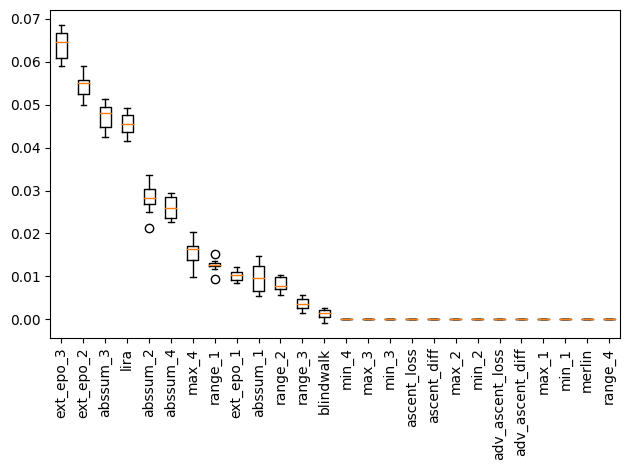
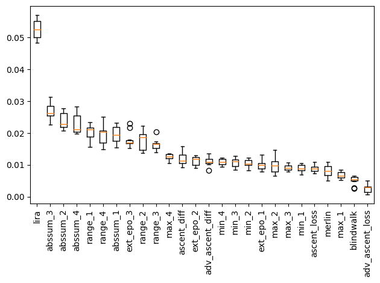
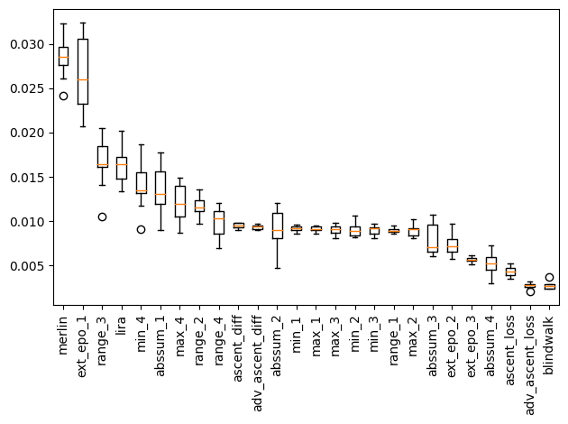

Here I describe my approach to the [MICO challenge](https://github.com/microsoft/MICO), co-located with [SaTML](https://satml.org/) 2023. Specifically, I walk through my solution for the
 [CIFAR track](https://codalab.lisn.upsaclay.fr/competitions/8551), which got me the [second position on the final leaderboard](https://codalab.lisn.upsaclay.fr/competitions/8551#results).
 I used the same approach for the Purchase100 track as well, but finished fourth. A description of all the winning approaches can be found [here](https://microsoft.github.io/MICO/).

Let's start by downloading relevant data from the MICO competition, which can be found [here](https://codalab.lisn.upsaclay.fr/competitions/8551#participate-submit_results) (for CIFAR).

```python
import os
import urllib

from torchvision.datasets.utils import download_and_extract_archive
from sklearn.metrics import roc_curve, roc_auc_score

from mico_competition.scoring import tpr_at_fpr, score, generate_roc, generate_table
from sklearn.metrics import roc_curve, roc_auc_score

import numpy as np
import torch
import csv
import copy

from torch.autograd import Variable
from sklearn import metrics
from tqdm.notebook import tqdm
from torch.distributions import normal
from torch.utils.data import DataLoader, Dataset
from mico_competition import ChallengeDataset, load_cifar10, load_model
from torch.distributions import Categorical
import torch.nn.utils.prune as prune

import pandas as pd
import matplotlib.pyplot as plt
import matplotlib
import torch as ch
import torch.nn as nn

from sklearn.model_selection import train_test_split
from sklearn import preprocessing
from sklearn.inspection import permutation_importance
from sklearn.preprocessing import StandardScaler
from sklearn.pipeline import make_pipeline
from sklearn import tree
from scipy.stats import norm

import autosklearn.classification
import autosklearn.metrics
```

## Features based on target model

Let's start by collecting features that, for a given target model, only utilize information from that model and any additional data. Later in the post, we will cover
features based on utilization of other 'reference' model and the problem setup.

The first feature I included is based on the approach described in [LiRA](<https://arxiv.org/abs/2112.03570>), using class-scaled logits instead of direct probabilities.

```python
def get_class_scaled_logits(model, features, labels):
    outputs = model(features).detach().cpu().numpy()
    num_classes = np.arange(outputs.shape[1])
    values = []
    for i, output in enumerate(outputs):
        label = labels[i].item()
        wanted = output[label]
        not_wanted = output[np.delete(num_classes, label)]
        values.append(wanted - np.max(not_wanted))
    return np.array(values)
```

Next, I use the [MERLIN](<https://arxiv.org/abs/2005.10881>) approach to sample neighbors and note variation in model loss. Modification uses log-scale while noting loss differences.

```python
@torch.no_grad()
def relative_log_merlin(model, features, labels):
    epsilon = 0.5
    small_value = 1e-10
    n_neighbors = 50
    criterion = torch.nn.CrossEntropyLoss(reduction='none')
    noise = normal.Normal(0, epsilon)
    diffs = []
    base_preds = model(features)
    base_losses = criterion(base_preds, labels).cpu().numpy()
    base_preds = base_preds.cpu().numpy()
    for i, feature in enumerate(features):
        neighbors = []
        distances = []
        for _ in range(n_neighbors):
            sampled_noise = noise.sample(feature.shape).to(feature.device)
            neighbors.append(feature + sampled_noise)
            distances.append(sampled_noise.mean().cpu().item())
        neighbors = torch.stack(neighbors, 0)
        loss_neighbors = criterion(model(neighbors), labels[i].view(1).repeat(n_neighbors))
        loss_change = ch.norm((loss_neighbors - base_losses[i])).item()
        # Use relative drop instead of absolute
        loss_change /= (small_value + base_losses[i].item())
        diffs.append(np.log(loss_change + small_value))
    diffs = np.array(diffs)
    # Clip at zero (lower side)
    diffs[diffs < 0] = 0
    return diffs
```

Next, I perform gradient-descent on the given data (using the training loss) to make modifications to the input.
Makes note of change in model loss after gradient ascent, as well as the change in the input itself.
My intuition here was that members would have less scope for loss reduction (and consequently smaller changes to the datum itself).

```python
def ascent_recovery(model, features, labels, adv: bool = False):
    criterion = torch.nn.CrossEntropyLoss(reduction='none')
    n_times = 10
    step_size = 0.01 if adv else 0.1 # For normal, use higher
    final_losses, final_dist = [], []
    for i, (feature, label) in enumerate(zip(features, labels)):
        model.zero_grad()
        feature_var = Variable(feature.clone().detach(), requires_grad=True)
        for j in range(n_times):
            feature_var = Variable(feature_var.clone().detach(), requires_grad=True)
            loss = criterion(model(ch.unsqueeze(feature_var, 0)), torch.unsqueeze(label, 0))
            loss.backward(ch.ones_like(loss), retain_graph=True)
            with ch.no_grad():
                if adv:
                    feature_var.data += step_size * feature_var.data
                else:
                    feature_var.data -= step_size * feature_var.data
                loss_new = criterion(model(ch.unsqueeze(feature_var, 0)), ch.unsqueeze(label, 0))
        # Get reduction in loss
        final_losses.append(loss.item() - loss_new.item())
        # Get change in data (norm)
        final_dist.append(ch.norm(feature_var.data - feature.data).detach().cpu().numpy())
    final_losses = np.stack((final_losses, final_dist), 1)
    return final_losses.reshape(-1, 2)
```

Next idea is to "train" model on given data to see how much loss changes. If was with DP, not seen many times (and with clipped gradient), so
expected loss decrease would be much more than that for some point that has already been seen multiple times.
While at it, I also take note of gradient norms
<div class="alert alert-info" role="alert">
I tried using the learning rates corresponding to different training mechanisms,
turns out that using the same, higher LR, works out best in practice.
</div>

```python
def extended_epoch(model, features, labels, use_dp: bool = False):
    lr = 0.05 # if use_dp else 0.0005
    criterion = nn.CrossEntropyLoss(reduction='none')
    features_collected = []
    # Note losses currently
    base_preds = model(features).detach()
    base_losses = criterion(base_preds, labels).cpu().numpy()
    for i, (feature, label) in enumerate(zip(features, labels)):
        # Make copy of model
        model_ = copy.deepcopy(model)
        model_.train()
        model_.cuda()
        optimizer = ch.optim.SGD(model_.parameters(), lr=lr, momentum=0)
        optimizer.zero_grad()
        loss = criterion(model_(ch.unsqueeze(feature, 0)), ch.unsqueeze(label, 0))
        loss.backward()
        optimizer.step()
        # Keep track of gradient norms
        gradient_norms = [ch.linalg.norm(x.grad.detach().cpu()).item() for x in model_.parameters()]
        # Keep track of updated loss
        loss_new = criterion(model_(ch.unsqueeze(feature, 0)), ch.unsqueeze(label, 0)).detach().cpu().numpy()
        loss_difference = (base_losses[i] - loss_new).item()
        gradient_norms += [loss_difference]
        features_collected.append(gradient_norms)
    features_collected = np.array(features_collected)
    features_collected = features_collected.reshape(features_collected.shape[0], -1)
    # Do not care about biases or loss diff
    features_collected = features_collected[:, [0, 2, 4]]
    # features_collected = np.log(features_collected + 1e-10)
    return features_collected.reshape(features_collected.shape[0], -1)
```

The next feature is inspired by [dataset inference](https://arxiv.org/abs/2104.10706).
It takes fixed-size steps in random directions (but same random direction) and keep track of how many steps it takes to flip classification.
The main idea here is that members/non-members would have different proximity to decision boundaries and thus would have different statistics for this result.

```python
def blind_walk(model, features, labels):
    # Track the number of steps taken until decision flips 
    # Walk no more than 100 steps, and try 10 different random directions
    num_directions = 10
    num_max_steps = 100
    point_of_failure = np.ones((num_directions, features.shape[0])) * np.inf
    std = 0.1
    for j in range(num_directions):
        noise = ch.randn_like(features) * std
        for i in range(1, num_max_steps + 1):
            new_labels = ch.argmax(model(features + noise * i).detach(), 1)
            flipped = np.nonzero((new_labels != labels).cpu().numpy())[0]
            point_of_failure[j][flipped] = np.minimum(point_of_failure[j][flipped], i)
    point_of_failure = np.clip(point_of_failure, 0, num_max_steps)
    point_of_failure = np.mean(point_of_failure, 0)
    return point_of_failure.reshape(-1, 1)
```

Now, we collect all of the features described above. Note that I also include an 'adv' variant for
gradient-ascent that instead looks to maximize loss instead of minimizing it.

```python
def custom_feature_collection(model, features, labels, use_dp: bool = False):
    features_collected = []
    features_collected.append(ascent_recovery(model, features, labels))
    features_collected.append(ascent_recovery(model, features, labels, adv = True))
    features_collected.append(extended_epoch(model, features, labels, use_dp = use_dp))
    features_collected.append(relative_log_merlin(model, features, labels).reshape(-1, 1))
    features_collected.append(get_class_scaled_logits(model, features, labels).reshape(-1, 1))
    features_collected.append(blind_walk(model, features, labels).reshape(-1, 1))
    combined_feratures = np.concatenate(features_collected, 1)
    return combined_feratures
```

## Features based on reference models

The problem structure and distribution of data (see [here](https://codalab.lisn.upsaclay.fr/competitions/8551#participate)) suggests that when looking at a given datapoint, it is more likely to have been
a member of another randomly selected model, than not being a member. My intention was to somehow utilize this information in the attack.

To compare these trends with reference models, I took inspiration from the [MATT](https://arxiv.org/pdf/1908.11229.pdf) attack, which works by computing gradient alignment between the given model and another reference model.
Although the original attack assumes linear models (and cannot work for convolutional layers/deep models), I figured gradient similarity would still be a useful metric to compare models.
For any given model, I sample 25 random reference models (out of all 100 train models) and compute gradient similarity between the given model and each reference model.

Below, we compute gradient similarity between the given model and some reference model.

```python
def matt_modified_scores(model, features, labels, model_reference):
    criterion = nn.CrossEntropyLoss(reduction='none')
    cos = nn.CosineSimilarity(dim=0)
    features_collected = []

    # Make copy of model
    model_ = copy.deepcopy(model)
    model_.cuda()

    for i, (feature, label) in enumerate(zip(features, labels)):
        # Compute gradients with both models
        model_.zero_grad()
        model_reference.zero_grad()
        loss = criterion(model_(ch.unsqueeze(feature, 0)), ch.unsqueeze(label, 0))
        loss_ref = criterion(model_reference(ch.unsqueeze(feature, 0)), ch.unsqueeze(label, 0))
        loss.backward()
        loss_ref.backward()
        
        # Compute product
        inner_features = []
        for p1, p2 in zip(model_.parameters(), model_reference.parameters()):
            term = ch.dot(p1.grad.detach().flatten(), p2.grad.detach().flatten()).item()
            inner_features.append(term)
        features_collected.append(inner_features)
    features_collected = np.array(features_collected)
    # Focus only on weight-related parameters
    features_collected = features_collected[:, [0, 2, 4, 6]]
    return features_collected
```

To aggregate gradient alignment information across reference models (since the reference models are randomly selected, so cannot compare across models), I compute
the range, mean of absolute values, min, and max of the gradient alignment scores.

```python
def extract_features_for_reference_models(reference_features):
    num_layers_collected = reference_features.shape[2]
    features = []
    for i in range(num_layers_collected):
        features.append((
            np.max(reference_features[:, :, i], 0) - np.min(reference_features[:, :,  i], 0),
            np.sum(np.abs(reference_features[:, :,  i]), 0),
            np.min(reference_features[:, :,  i], 0),
            np.max(reference_features[:, :,  i], 0)
        ))
    return np.concatenate(features, 0).T
```

Let's start collecting all train models.

```python
def collect_models():
    """
        Collect all models from the 'train' set
    """
    CHALLENGE = "cifar10"
    LEN_TRAINING = 50000
    LEN_CHALLENGE = 100
    scenarios = os.listdir(CHALLENGE)

    dataset = load_cifar10(dataset_dir="/u/as9rw/work/MICO/data")

    collected_models = {x:[] for x in scenarios}
    phase = "train"
    for scenario in tqdm(scenarios, desc="scenario"):
        root = os.path.join(CHALLENGE, scenario, phase)
        for model_folder in tqdm(sorted(os.listdir(root), key=lambda d: int(d.split('_')[1])), desc="model"):
            path = os.path.join(root, model_folder)
            challenge_dataset = ChallengeDataset.from_path(path, dataset=dataset, len_training=LEN_TRAINING)
            challenge_points = challenge_dataset.get_challenges()
            
            model = load_model('cifar10', path)
            collected_models[scenario].append(model)

        collected_models[scenario] = np.array(collected_models[scenario], dtype=object)
            
    return collected_models
```

```python
train_models = collect_models()
```

Feature vectors are thus a combination of two kinds of features. The first set (originating from `matt_modified_scores`) uses reference models and reference statistics between a given model and these reference models. The second set of features, originating from `custom_feature_collection`, does not use any additional reference models.

<div class="alert alert-info" role="alert">
<b>For Purchase100:</b> without the reference-model-based features, the attack had a maximum TPR@0.1FPR of $\approx0.13$, and immediately jumped to $0.15$ with the inclusion of those reference-model-based features. Additional experimentation with the meta-classifier itself bumped performance further up to $>0.16$. My experience with these MI attacks has been that <b><u>the choice of meta-classifier also matters</u></b>. Most of the MI-related papers I looked at use LR-based models when dealing with features. It thus might be worthwhile to spend some time on feature engineering (using the same set of raw features) and meta-classifier optimization.
</div>

```python
CHALLENGE = "cifar10"
scenarios = os.listdir(CHALLENGE)
phase = "train"
dataset = load_cifar10(dataset_dir="/u/as9rw/work/MICO/data")
LEN_TRAINING = 50000
LEN_CHALLENGE = 100

X_for_meta, Y_for_meta = {}, {}
num_use_others = 25 # 50 worked best, but too slow

# Check performance of approach on (1, n-1) models from train
for scenario in tqdm(scenarios, desc="scenario"):
    use_dp = not scenario.endswith('_inf')
    preds_all = []
    scores_all = []
    root = os.path.join(CHALLENGE, scenario, phase)
    all_except = np.arange(100)

    for i, model_folder in tqdm(enumerate(sorted(os.listdir(root), key=lambda d: int(d.split('_')[1]))), desc="model", total=100):
        path = os.path.join(root, model_folder)
        challenge_dataset = ChallengeDataset.from_path(path, dataset=dataset, len_training=LEN_TRAINING)
        challenge_points = challenge_dataset.get_challenges()
        
        challenge_dataloader = torch.utils.data.DataLoader(challenge_points, batch_size=2*LEN_CHALLENGE)
        features, labels = next(iter(challenge_dataloader))
        features, labels = features.cuda(), labels.cuda()
            
        model = load_model('cifar10', path)
        model.cuda()
        features, labels = features.cuda(), labels.cuda()
        # Look at all models except this one
        other_models = train_models[scenario][np.delete(all_except, i)]
        # Pick random models
        other_models = np.random.choice(other_models, num_use_others, replace=False)
        other_models = [x.cuda() for x in other_models]

        features_collected = np.array([matt_modified_scores(model, features, labels, other_model) for other_model in other_models])
        scores = extract_features_for_reference_models(features_collected)
        other_features = custom_feature_collection(model, features, labels, use_dp = use_dp)
        scores = np.concatenate((scores, other_features), 1)

        mem_labels = challenge_dataset.get_solutions()

        # Store
        preds_all.append(mem_labels)
        scores_all.append(scores)
    
    preds_all = np.concatenate(preds_all)
    scores_all = np.concatenate(scores_all)
    
    X_for_meta[scenario] = scores_all
    Y_for_meta[scenario] = preds_all
```

Use [auto-sklearn](https://automl.github.io/auto-sklearn/master/) (an automl package does does pipeline, optimizer, and hyper-param optimization for you) worked out best, second to using random-forest classifiers.
<div class="alert alert-info" role="alert">
In all scenarios, training classifiers separately for the different scenarios (no, low, high DP) worked better than training a single classifier, even when the scenario is explicitly provided as an input feature (one-hot encoding).
</div>

```python
# Train different meta-classifiers per scenario
CHALLENGE = "cifar10"
scenarios = os.listdir(CHALLENGE)
meta_clfs = {x: autosklearn.classification.AutoSklearnClassifier(memory_limit=64 * 1024, time_left_for_this_task=180, metric=autosklearn.metrics.roc_auc) for ii, x in enumerate(X_for_meta.keys())}

avg = 0
use_all = False
for sc in scenarios:
    train_split_og, test_split_og = train_test_split(np.arange(100), test_size=20)
    train_split = np.concatenate([np.arange(200) + 200 * i for i in train_split_og])
    test_split = np.concatenate([np.arange(200) + 200 * i for i in test_split_og])
    if use_all:
        X_train = X_for_meta[sc]
        X_test  = X_for_meta[sc]
        y_train = Y_for_meta[sc]
        y_test  = Y_for_meta[sc]
    else:
        X_train = X_for_meta[sc][train_split]
        X_test  = X_for_meta[sc][test_split]
        y_train = Y_for_meta[sc][train_split]
        y_test  = Y_for_meta[sc][test_split]

    meta_clfs[sc].fit(X_train, y_train)
    preds = meta_clfs[sc].predict_proba(X_test)[:, 1]
    preds_train = meta_clfs[sc].predict_proba(X_train)[:, 1]
    
    print(f"{sc} AUC (train): {roc_auc_score(y_train, preds_train)}")
    scores = score(y_test, preds)
    scores.pop('fpr', None)
    scores.pop('tpr', None)
    display(pd.DataFrame([scores]))
    avg += scores['TPR_FPR_1000']

print("Average score", avg / 3)
```

For submissions, I set `use_all` to True (since the autoML classifier already does train-val splits internally). The train-test split above is just for visualization purposes (and to see how well the classifier performs on val data).

## Feature Inspection

A closer look (via permutation importance) at the features shows some interesting trends.

```python
from sklearn.inspection import plot_partial_dependence, permutation_importance

labels = []
for i in range(4):
    labels.append(f"range_{i+1}")
    labels.append(f"abssum_{i+1}")
    labels.append(f"min_{i+1}")
    labels.append(f"max_{i+1}")
labels.append("ascent_loss")
labels.append("ascent_diff")
labels.append("adv_ascent_loss")
labels.append("adv_ascent_diff")
labels.append("ext_epo_1")
labels.append("ext_epo_2")
labels.append("ext_epo_3")
labels.append("merlin")
labels.append("lira")
labels.append("blindwalk")
```

```python

scenario = "cifar10_inf"
r = permutation_importance(meta_clfs[scenario], X_for_meta[scenario], Y_for_meta[scenario], n_repeats=10, random_state=0)
sort_idx = r.importances_mean.argsort()[::-1]

plt.boxplot(
    r.importances[sort_idx].T, labels=[labels[i] for i in sort_idx]
)
    
plt.xticks(rotation=90)
plt.tight_layout()
plt.show()

for i in sort_idx[::-1]:
    print(
        f"[{i}] {labels[i]:10s}: {r.importances_mean[i]:.3f} +/- "
        f"{r.importances_std[i]:.3f}"
    )
```

The abs-sum and range of gradient alignment values across reference models seem to be most useful.
Features like LiRA and gradient norms in the extended-epoch simulation also seem to be important for the case of no DP.



    ...
    [20] ext_epo_1 : 0.010 +/- 0.001
    [0] range_1   : 0.013 +/- 0.001
    [15] max_4     : 0.016 +/- 0.003
    [13] abssum_4  : 0.026 +/- 0.003
    [5] abssum_2  : 0.028 +/- 0.003
    [24] lira      : 0.045 +/- 0.002
    [9] abssum_3  : 0.047 +/- 0.003
    [21] ext_epo_2 : 0.054 +/- 0.003
    [22] ext_epo_3 : 0.064 +/- 0.003

However, the same trend does not hold when looking at models with DP.



    ...
    [22] ext_epo_3 : 0.018 +/- 0.002
    [1] abssum_1  : 0.020 +/- 0.003
    [12] range_4   : 0.020 +/- 0.003
    [0] range_1   : 0.020 +/- 0.002
    [13] abssum_4  : 0.023 +/- 0.003
    [5] abssum_2  : 0.024 +/- 0.003
    [9] abssum_3  : 0.027 +/- 0.002
    [24] lira      : 0.053 +/- 0.003

In this case, most of the classifier's performance seems to originate from LiRA, followed by features extracted from reference models. However, features like the one
extracted from the extended-epoch simulation seem to be less somewhat important - in fact, more than they are in the case of no DP.

Interestingly, for the case of low-$\epsilon$ DP, merlin-based features turn out to be the most important.



    ...
    [15] max_4     : 0.012 +/- 0.002
    [1] abssum_1  : 0.014 +/- 0.003
    [14] min_4     : 0.014 +/- 0.002
    [24] lira      : 0.016 +/- 0.002
    [8] range_3   : 0.017 +/- 0.003
    [20] ext_epo_1 : 0.027 +/- 0.004
    [23] merlin    : 0.028 +/- 0.002

The utility of each of these features, though, is significantly lower than scenarios with higher-$\epsilon$ DP, or no DP at all. This is understandable, since the DP is very much intended
to reduce membership inference risk. However, it is interesting that the relative utility of features is not same across the scenarios, further showing why having individual meta-classifiers for the
scenarios is useful.

<hr>

Next, we collect features for all models across scenarios and phases. Helps to re-use features when experiment with different meta-classifiers. No need to re-run for 'train' models, since we already have features for those.

```python
CHALLENGE = "cifar10"
LEN_TRAINING = 50000
LEN_CHALLENGE = 100

scenarios = os.listdir(CHALLENGE)
phases = ['dev', 'final']
stored_features = {}

dataset = load_cifar10(dataset_dir="/u/as9rw/work/MICO/data")

for i, scenario in tqdm(enumerate(scenarios), desc="scenario", total=3):
    use_dp = not scenario.endswith('_inf')
    stored_features[scenario] = {}
    for phase in tqdm(phases, desc="phase"):
        stored_features[scenario][phase] = []
        root = os.path.join(CHALLENGE, scenario, phase)
        all_except = np.arange(100)
        for j, model_folder in tqdm(enumerate(sorted(os.listdir(root), key=lambda d: int(d.split('_')[1]))), desc="model", total=len(os.listdir(root))):
            path = os.path.join(root, model_folder)
            challenge_dataset = ChallengeDataset.from_path(path, dataset=dataset, len_training=LEN_TRAINING)
            challenge_points = challenge_dataset.get_challenges()
            
            model = load_model('cifar10', path)
            challenge_dataloader = torch.utils.data.DataLoader(challenge_points, batch_size=2*LEN_CHALLENGE)
            features, labels = next(iter(challenge_dataloader))

            model.cuda()
            features, labels = features.cuda(), labels.cuda()
            # Look at all models except this one
            other_models = train_models[scenario][np.delete(all_except, j)]
            other_models = np.random.choice(other_models, num_use_others, replace=False)
            features_collected = np.array([matt_modified_scores(model, features, labels, other_model.cuda()) for other_model in other_models])
            scores = extract_features_for_reference_models(features_collected)
            other_features = custom_feature_collection(model, features, labels, use_dp=use_dp)
            processed_features = np.concatenate((scores, other_features), 1)

            stored_features[scenario][phase].append(processed_features)
```

Time to generate predictions!

```python
CHALLENGE = "cifar10"
LEN_TRAINING = 50000
LEN_CHALLENGE = 100

scenarios = os.listdir(CHALLENGE)
phases = ['dev', 'final']

dataset = load_cifar10(dataset_dir="/u/as9rw/work/MICO/data")

for i, scenario in tqdm(enumerate(scenarios), desc="scenario", total=3):
    for phase in tqdm(phases, desc="phase"):
        root = os.path.join(CHALLENGE, scenario, phase)
        j = 0
        for model_folder in tqdm(sorted(os.listdir(root), key=lambda d: int(d.split('_')[1])), desc="model"):
            path = os.path.join(root, model_folder)
            features_use = stored_features[scenario][phase][j]
            # Using scenario-wise meta-classifier
            predictions = meta_clfs[scenario].predict_proba(features_use)[:, 1]
            j += 1
            assert np.all((0 <= predictions) & (predictions <= 1))

            with open(os.path.join(path, "prediction.csv"), "w") as f:
                 csv.writer(f).writerow(predictions)
```

Packaging the submission: now we can store the predictions into a zip file, which you can submit to CodaLab.

```python
import zipfile

phases = ['dev', 'final']
experiment_name = "final_submission"

with zipfile.ZipFile(f"submissions_cifar/{experiment_name}.zip", 'w') as zipf:
    for scenario in tqdm(scenarios, desc="scenario"): 
        for phase in tqdm(phases, desc="phase"):
            root = os.path.join(CHALLENGE, scenario, phase)
            for model_folder in tqdm(sorted(os.listdir(root), key=lambda d: int(d.split('_')[1])), desc="model"):
                path = os.path.join(root, model_folder)
                file = os.path.join(path, "prediction.csv")
                if os.path.exists(file):
                    zipf.write(file)
                else:
                    raise FileNotFoundError(f"`prediction.csv` not found in {path}. You need to provide predictions for all challenges")
```

## Takeaways

This was my first stint with actively developing and launching a membership inference attack, and I definitely learned a lot! I can now see that membership inference is **hard**, even when access to a highly-overlapping dataset (and models trained on similar data) are provided. I also learned that while using observation-based features directly (such as LiRA, scaled to the $[0, 1]$ scale) is commonpractice in MI literature, switching to better classifiers than linear regression (better yet- automating the entire model pipeline) can give non-trivial boosts in performance. I hope this post was helpful to you, and I'd love to hear your thoughts and feedback!

My solution (for both CIFAR and Purchase100) are available here: [https://github.com/iamgroot42/MICO](https://github.com/iamgroot42/MICO)
